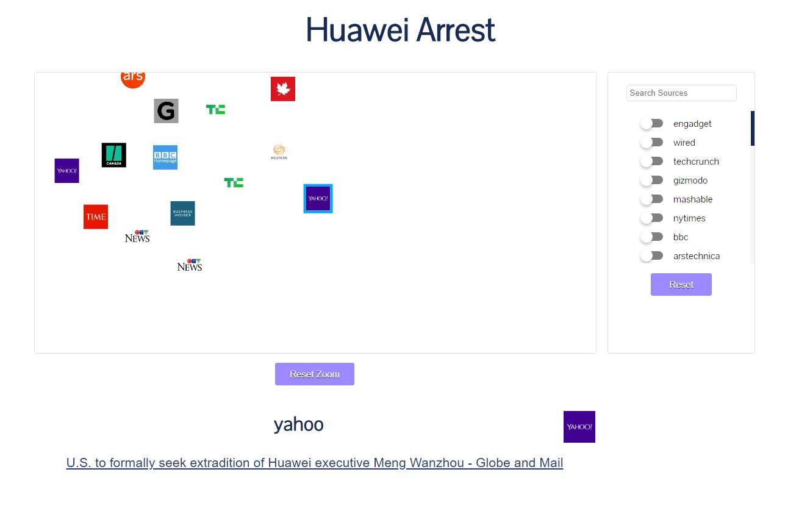
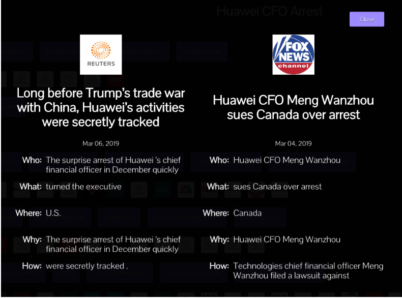
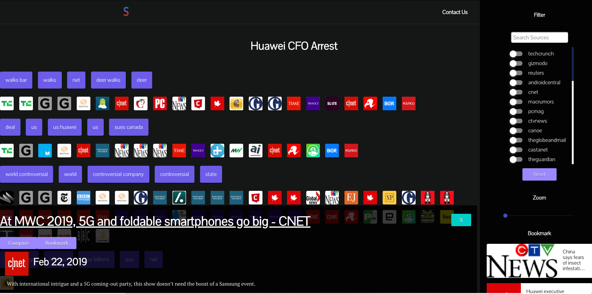
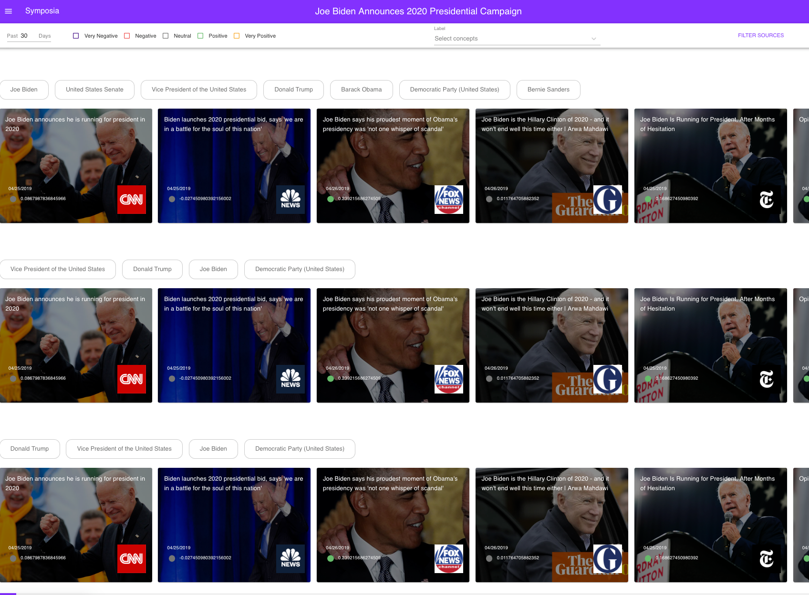

# Welcome to Symposia! 

## Check it out: https://symposia.me/

Symposia is an application that enables news junkies and other individuals with a vested interest in the news, like journalists and students, to examine current news stories within a broader context using our analytic tools. Parse through hundreds of news articles from dozens of news sources from around the world and explore a news story from multiple perspectives.

This application was initially built by Aman Arya, Jonathan Chuang, Leandro Solidum, and Thejas Vidyasagar as part of the 2019 Informatics Capstone at University of Washington.

This application will be no longer be updated regularly starting June 30th, 2019

Data from user interviews is still being kept separately from this github repository in case of future development that requires further analysis of this data. Testers were aware of and consented to the archival of this data.

This github repository will remain open and public in case of any future motivations to revive or continue the project, as well as for portfolio and showcase purposes. 

# Features

## Extracting key people/places/events

We organize our news articles around the idea of **concepts** taken from the EventRegistry platform. A concept is “any word (or a set of words) that has a Wikipedia page. It is an annotation that can be assigned to an article or an event. Concepts can represent entities (people, locations, organizations) or non-entities (things such as a table, personal computer, toy, robot, etc.). 

Through our utilization of concepts users of Symposia can not only identify key actors and events within a story, but is also a way for our platform to identify and differentiate between different articles. 

For more information about concepts, please visit this [link](https://event-registry.drift.help/article/what-are-concepts/).

## Concepts Graph

See the most important and relevant concepts within a story at a glance and see how they all relate to each other. Users can explore our concepts graph to identify the major actors within a story and filter news stories that discuss these major concepts.  

## Sentiment Filtering

Filter out articles based on their sentiment to the overall story. We are utilizing their sentiment analysis tool done by the EventRegistry API and use their “vocabulary based” sentiment analysis. 

For more information, please visit this [link](https://eventregistry.org/documentation/api?tag=Text_Analytics).

## Similar/Different Article Recommendations

Article recommendations are produced by a combination of hierarchical clustering for grouping articles together, LDA for moving topic selection, and cosine similarity to identify top recommendations and non-recommendations. 

## Concept Highlighting

Automatically highlight the relevant concepts and key actors within any given news article. Users can then highlight unfamiliar concepts to open up a small popup that gives the wikipedia summary on the concept. 

## Concepts Filtering

Users interested in a very specific aspect of the story (a certain person, place, event, etc.) can filter stories that discuss this aspect using our Concept Filtering bar, to search our complete list of extracted concepts. Multiple concepts can be filtered as well for more specific results. 

## Source Filtering

Of course, users can also pick and choose any specific news sources they would like to read from.

## Technologies used:

* Amazon Web Services (AWS)
    * Database/Storage
* EventRegistry
    * API endpoint to extract news articles, concepts, sentiment
* React
    * Material UI: For UI components
    * React-Vis-Force: For the Concept Graph
* News API *deprecated*
    * Used this in the past to extract news articles

# A Brief and Incomplete History

Our application began as a visualization tool that was meant to show news articles clustered together and summarizations between news articles, so users could easily compare different news articles with each other and get the overall “perspective” before diving deeper. We initially compared articles numerically based on vector values extrapolated from the article texts themself using popular methods such as Doc2Vec + KMeans clustering approach.

While this approach had mixed results, our initial implementation created a vague, nonsensical visualization that simply showed users floating clusters of news articles, with no explanation of what these clusters were. Users could click on the news source to see the article, but without any explanation of what the floating clouds were users were quickly confused by what our application was trying to do.

*Figure 1: Our first prototype involving floating news squares*

Based on these findings, we switched up the design and therefore the user experience and interaction of our application, making it behave and appear more like a news aggregator whilst maintaining the original features of the visualization, like the article clustering.  We also then added other tools and features like a news article comparison tool and article bookmarking. The comparison tool we developed involved developing summaries of both articles and displaying them next to each other, hoping that would help the users develop an understanding of the similarities and differences between articles. The summarization tool we developed was a variation of the 5W1H tool developed by fhamborg which can be found here.

*Figure 2: Draft of our comparison tool* 

Our user research and testing for this new design and the new features told us that our user interface still needed sufficient polish and work, as it still remained somewhat clunky to use. Furthermore our comparison tool did not work as well as intended due to user’s not knowing which articles to compare. While they reported it as theoretically useful, in practice user’s found the summaries to be often more confusing than enlightening.

*Figure 3: Our second, more fleshed out redesign. Still have news squares though.*

We then created another redesigned user interface, and also made some significant changes in the backend, switching from using News API to the  EventRegistry API that came with better and more precise filtering, as well as a lot of tools and analytics that we could build our application off of. This redesign yielded fair results in terms of user experience, with a much cleaner and seamless experience, but the problem remained with our news article clustering. 

Even after building our clusters based on the concepts infrastructure of Event Registry, the clusters were still nonsensical and confusing, with articles showing up in different clusters multiple times, with no clear indication of why and how the articles were related. It was simply still too hard for a user to determine what defined the cluster. 

Figure 3: Our third redesign. Now with news rectangles.

Our final development cycle included UI fixes that would greatly improve our user experience, and the addition of a concept graph that was shown to be compelling and interesting to users who came into contact with it. We needed to come up with a new feature that would replace our clustering and allow for the initial exploration and understanding of a news story. This concept graph showed users the co-occurence of key concepts within articles, giving them an understanding of the varying aspects of a story that were being covered and to what extent. By exploring this graph, they would have a broader understanding of the different perspectives, narratives, and coverage that exist for a given news story. Check this version out at: https://symposia.me/

# Style Guide

This style guide is incomplete. We are building off of Google’s Material Design as a baseline, however future iterations of the design of Symposia may and could deviate into its own design language. 

## Colors
Primary: #8331FE 
Secondary: #FFFFFF
Text: #707070
Text Secondary: #FFFFFF

## Typography
Headers and Labels: Pontano Sans 
Text: Helvetica

# Contact Information

Have more questions? Tips? 
Contact aman.arya524@gmail.com. 

Or open an issue on Github.

